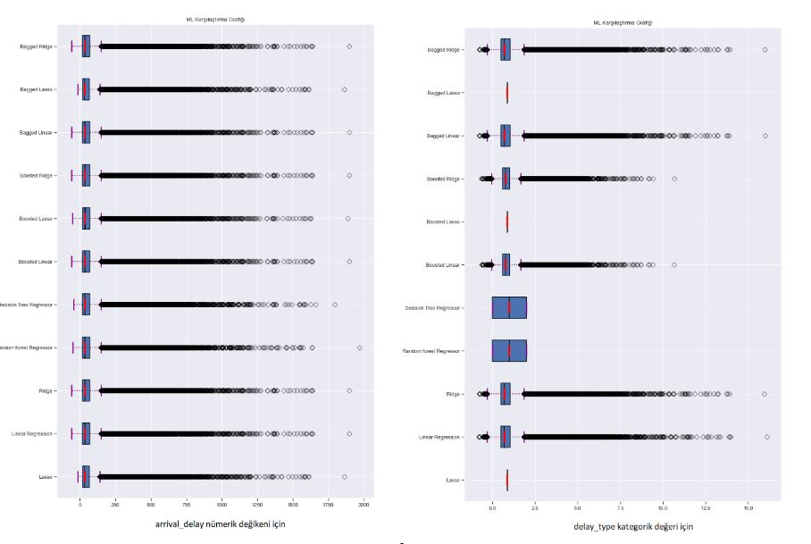

# Flight Delay EDA and Prediction
Factors Affecting Flight Delays and a Study on Delay Estimation Using EDA and Machine Learning Models: The Case of 2015 American Flights 

This beginner project is completed to further understand the importance of carefully manipulating data, feature selection and model building in order to make predictions based on existing data.

### Notes
Keep in mind that this is a beginners project and there may be errors or better ways to do this. 
Also there is a detailed report including an introduction part from the existing literature, details of the applied methods and findings is uploaded. The report language is Turkish. If translated use self-caution as the strcuture of the lanugage used is complex.
If you run the prediction part based on the delay_type right after you run the prediction based on arrival delay; you will get an error as the delay_type variable was dropped during the feature selection of the model for arrival delay. You can either create a second dataframe to work on or just re-run after commenting the needed codes.

## Abstract

The aim of this study is to determine the variables affecting flight delays and their effects, to examine them in detail and to make predictions on delays using machine learning approaches in accordance with the findings obtained in order to predict flight delays. The flight data set of 2015 published by the Bureau of Transportation Statistics of the US Department of Transportation (DOT) was used in the study. (https://www.kaggle.com/datasets/usdot/flight-delays?datasetId=810 )

First, basic inferences were made with exploratory data analysis methods. Afterwards, analyzes were made on the cleaned data set with the selected methods and it was examined which variables and situations caused the delays in the flights. The findings showed that departure delays trigger arrival delays and overall delays are closely related to the airport of departure and arrival and airline companies.

In accordance with the findings, the data set was divided into training and testing and modeling was done. First, estimation was made on the arrival delay, then according to the delay_type categorical values created according to the delay time intervals.Then, predictions were made with 'Lasso', 'Linear Regression', 'Ridge', 'Random forest Regressor', 'Decision Tree Regressor', 'Boost regression', and 'Bagged Regression' methods. In order to systematically analyze the models and make comparisons with each other, the Box Whisker Plot method proposed by Katardjiev, McKeever, and Andreas Hamfelt (2019) was applied to make model comparisons.

